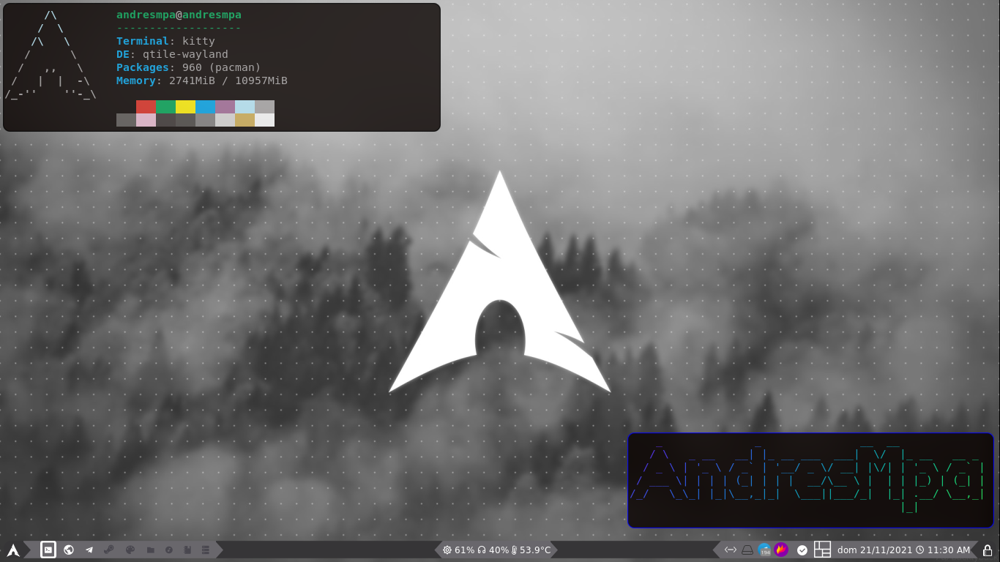

Hey there, I’m @AndresMpa **I'm a software developer** who teach himself as much as possible;
I'm a **software engineering student** and I almost finish my career. These days I'm quite sick,
so I'm working on my own projects... But I'd like to colaborate in amazing people

I'm learning:

- TypeScript!!! 
- Python for hardware
- Advance bash usage

I'm interested in:

- Software architecture (Currently knowing: SPA, Monolithic, Rest)
- Software development (Games or Web)
- GNU/Linux, specially Arch Linux (Which is my favorite one)
- Data science

You can find me:

- [Linkedin](https://www.linkedin.com/in/andres-m-prieto/?locale=en_US), also in spanish [here](https://www.linkedin.com/in/andres-m-prieto/?locale=es_ES)
- [Medium](https://andresprieto-25116.medium.com/)
- [Discord](TheDreamerKing#0141); here, I meet my friends
