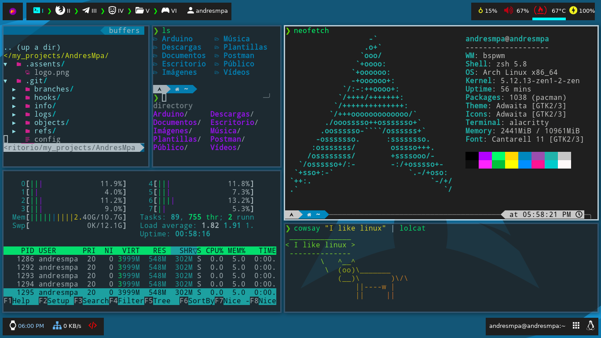

Hey there, I’m @AndresMpa **I'm a web developer** who teach himself as much as possible;
I'm a **software engineering student** and I almost finish my career. Currently I'm working
at [Delphi Analytics](https://www.linkedin.com/company/delphi-analytics/)

I'm learning:

- Automatization
- Clear writting
- Backend in Node.js

I'm interested in:

- Web dev
- Games dev
- Arch Linux
- Data science

You can find me on [Linkedin](https://www.linkedin.com/in/andres-m-prieto/?locale=en_US),
you can also check it in spanish [here](https://www.linkedin.com/in/andres-m-prieto/?locale=es_ES)
(I speak both languages) and... Check on my GitHub profile, you might find something cool
